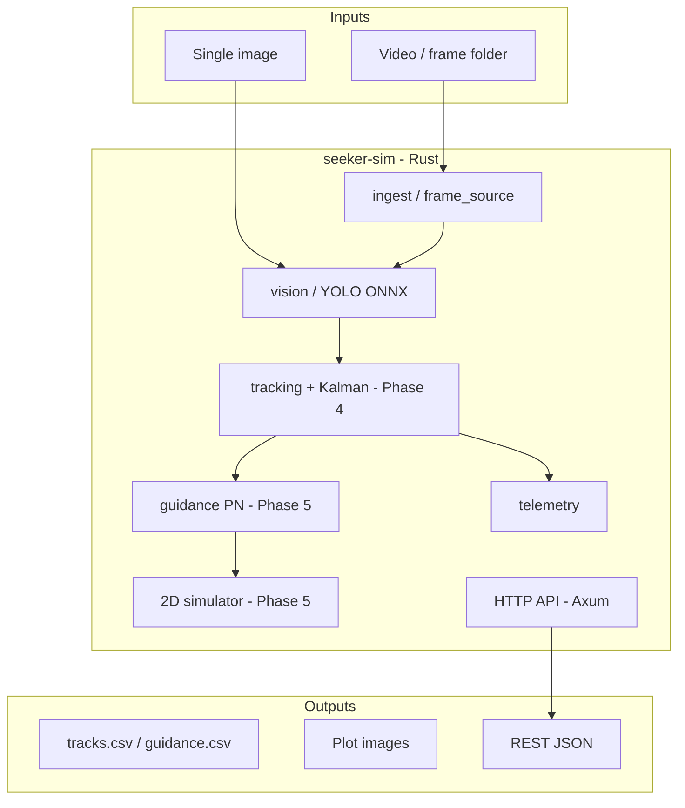

# SeekerSim

This was intended as practice to use claude/cursor to create a demo of a seeker object tracking and changing course to intercept a video of a dot moving across the screen. 
Also intended was this to be a learning project for exposure to the Rust language. C# analogies are included within as I am a .NET developer currently.
This repository is to be taken as a learning guide to rust and how to properly design markdown files for a coherent and accurate agentic AI developing experience.

**Visual tracking and closed-loop guidance simulation in Rust.**

SeekerSim ingests video (or frame sequences), uses AI to **detect and track** a fast-moving target, estimates its motion with a filter, and runs a **proportional navigation (PN)** guidance law in software—producing steering commands for a simulated pursuer. Everything runs **locally** on your machine.

**Portfolio intent:** Not an OpenAI wrapper—a **local ML platform** (ONNX vision + optional Qdrant + Ollama) with full Rust orchestration.

> **Status (2026-05):** Phases **1–4** complete — health API, YOLO detect, frame pipeline, motion + Kalman tracking with `tracks.csv`. **Next:** Phase 5 guidance + sim intercept.

**Repository:** [github.com/Kschmidt111/Rust-AI-proj](https://github.com/Kschmidt111/Rust-AI-proj)

---

## What works today


Full crate commands and layout: [crates/seeker-sim/README.md](crates/seeker-sim/README.md).

---

## Quick start (fresh clone)

From repo root (Windows PowerShell):

```powershell
# 1. Dependencies (one-time)
.\scripts\download-model.ps1
.\scripts\download-sample-image.ps1

# 2. Build
cd crates\seeker-sim
cargo test

# 3. Single image → JSON detections
cargo run -- detect --input ../../data/samples/test.jpg

# 4. Synthetic frame sequence (100 PNGs) → per-frame log
cd ..\..
.\scripts\generate-dot-video.ps1
cd crates\seeker-sim
$env:RUST_LOG = "seeker_sim=info"
cargo run -- process --input ../../data/frames/dot_run_001
```

`models/` and `data/` contents are **gitignored**—use the scripts above after clone.

---

## CLI overview

| Subcommand | Purpose |
|------------|---------|
| `serve` (default) | Axum server on `127.0.0.1:8080` |
| `detect --input <image>` | One-shot YOLO → JSON to stdout |
| `process --input <folder>` | Sorted PNG/JPEG folder → detection count + ms per frame |
| `track --input <folder>` | Motion + Kalman track → `tracks.csv` under `data/output/` |

Config: [config/default.toml](config/default.toml) (model path, thresholds, bind address).

---

## System diagram (high level)



---

## Documentation map

| Document | Use when you need… |
|----------|---------------------|
| **[docs/DEVELOPMENT.md](docs/DEVELOPMENT.md)** | Coding standards, learning pace, module rules |
| [docs/ARCHITECTURE.md](docs/ARCHITECTURE.md) | Components, data flow, types, file tree |
| [docs/TOOLS.md](docs/TOOLS.md) | Every tool/library and why we chose it |
| [docs/LEARNING_ROADMAP.md](docs/LEARNING_ROADMAP.md) | Phased build + Rust learning goals |
| [docs/DECISIONS.md](docs/DECISIONS.md) | Architecture decision records (ADRs) |
| [docs/GLOSSARY.md](docs/GLOSSARY.md) | Tracking & guidance terminology |

---

## Repository layout

```
Rust-AI-proj/
├── docs/                      # Reference documentation
├── crates/seeker-sim/         # Rust binary + library (see crate README)
├── models/                    # Gitignored — yolov8n.onnx
├── data/                      # Gitignored — samples, frames, output
├── scripts/                   # Download model, extract frames, pre-push check
├── config/default.toml        # Server, vision, tracking thresholds
└── README.md
```

Module breakdown: [docs/ARCHITECTURE.md](docs/ARCHITECTURE.md).

---

## Prerequisites

| Tool | Purpose |
|------|---------|
| [Rust (rustup)](https://rustup.rs/) | Build and run |
| [Visual Studio Build Tools](https://visualstudio.microsoft.com/downloads/) (Windows) | Native deps for ONNX Runtime |
| [ffmpeg](https://ffmpeg.org/) (optional) | `scripts/extract-frames.ps1` — MP4 → PNG |
| NVIDIA GPU (optional) | Faster ONNX via CUDA execution provider |

Details: [docs/TOOLS.md](docs/TOOLS.md).

---

## Learning contract

Public functions include doc comments (summary, args, returns) and optional **C# analogies**. Standards: [docs/DEVELOPMENT.md](docs/DEVELOPMENT.md) · [docs/LEARNING_ROADMAP.md](docs/LEARNING_ROADMAP.md).

---

## Security before push

Run `.\scripts\pre-push-check.ps1` before `git push`. See [rules.md](rules.md).
