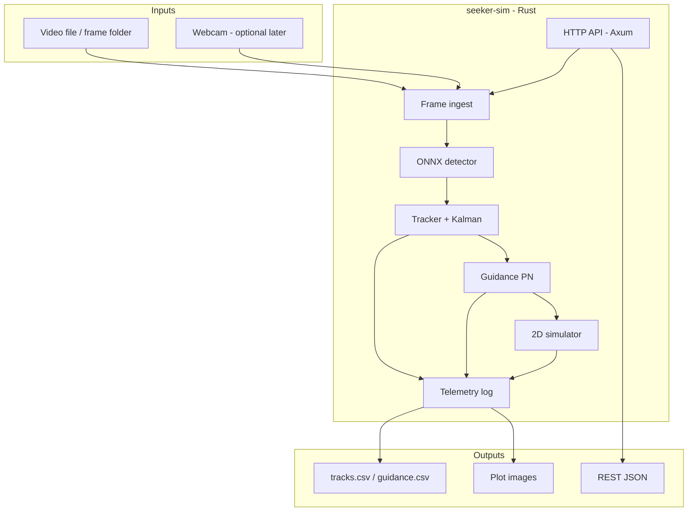

# SeekerSim

**Visual tracking and closed-loop guidance simulation in Rust.**

SeekerSim ingests video (or frame sequences), uses AI to **detect and track** a fast-moving target, estimates its motion with a filter, and runs a **proportional navigation (PN)** guidance law in software—producing steering commands as if a seeker were processing imagery mid-flight. Everything runs **locally** on your machine

> **Status:** Phase 0 — documentation and architecture. Application code starts in Phase 1.

**Repository:** [github.com/Kschmidt111/Rust-AI-proj](https://github.com/Kschmidt111/Rust-AI-proj)

---

## What it does (one paragraph)

A Rust application reads frames from a file, folder, or camera, detects objects with an **ONNX** model (YOLO), associates detections into a **stable track**, smooths motion with a **Kalman filter**, computes **line-of-sight (LOS)** angles to the target, and feeds a **guidance** module that outputs commanded acceleration for a **2D simulator** (interceptor vs target). Results are logged as JSON/CSV and can be plotted for demos.

---

## System diagram (high level)



---

## Documentation map (reference hub)

| Document | Use when you need… |
|----------|---------------------|
| [docs/PROJECT_BRIEF.md](docs/PROJECT_BRIEF.md) | Goals, scope, interview pitch, ethics |
| [docs/ARCHITECTURE.md](docs/ARCHITECTURE.md) | Components, data flow, types, **file tree** |
| [docs/TOOLS.md](docs/TOOLS.md) | **Every tool/library, why we chose it, what it does** |
| [docs/LEARNING_ROADMAP.md](docs/LEARNING_ROADMAP.md) | Phased build + Rust learning goals |
| [docs/DECISIONS.md](docs/DECISIONS.md) | Architecture decision records |
| [docs/GLOSSARY.md](docs/GLOSSARY.md) | Tracking & guidance terminology |

---

## Repository layout (planned)

```
Rust-AI-proj/
├── docs/                      # Reference documentation (start here)
├── crates/
│   └── seeker-sim/            # Main Rust binary + library modules
├── models/                    # Gitignored — YOLO ONNX weights
├── data/                      # Gitignored — videos, frames, outputs
├── scripts/                   # ffmpeg frame extract, model download
├── config/
│   └── default.toml           # Paths, thresholds, sim parameters
└── README.md
```

Full module breakdown: [docs/ARCHITECTURE.md#repository--file-structure](docs/ARCHITECTURE.md#repository--file-structure).

---

## Prerequisites (before Phase 1 code)

| Tool | Purpose |
|------|---------|
| [Rust (rustup)](https://rustup.rs/) | Build and run the project |
| [Visual Studio Build Tools](https://visualstudio.microsoft.com/downloads/) (Windows) | C++ toolchain for some native deps |
| [ffmpeg](https://ffmpeg.org/) (optional Phase 3+) | Extract frames from video on Windows without OpenCV build pain |
| NVIDIA GPU + CUDA (optional) | Faster ONNX inference via execution provider |

Details: [docs/TOOLS.md](docs/TOOLS.md).


