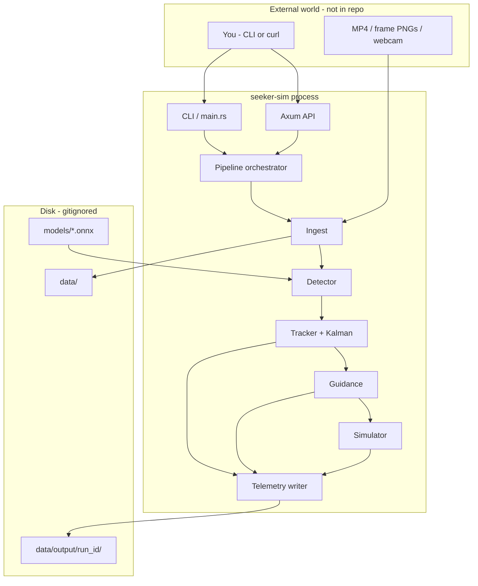
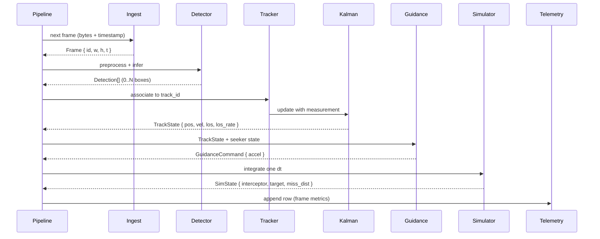
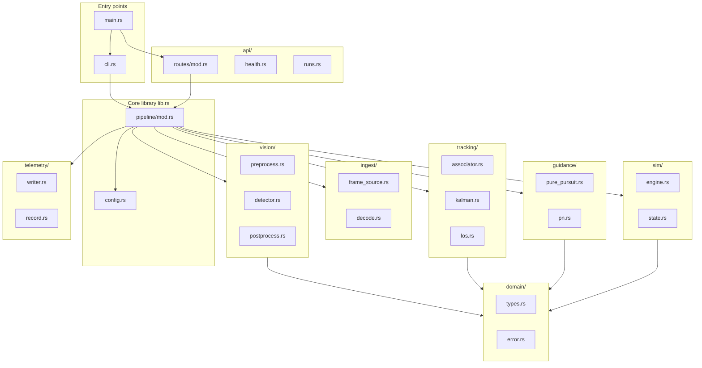
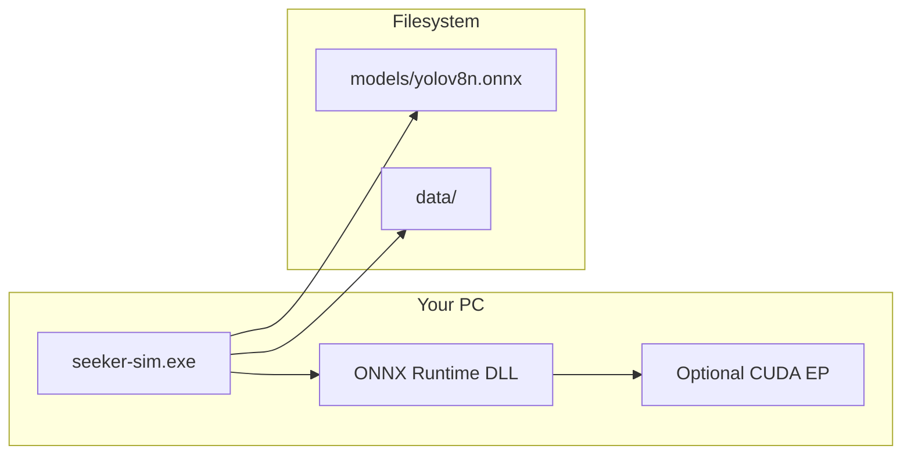
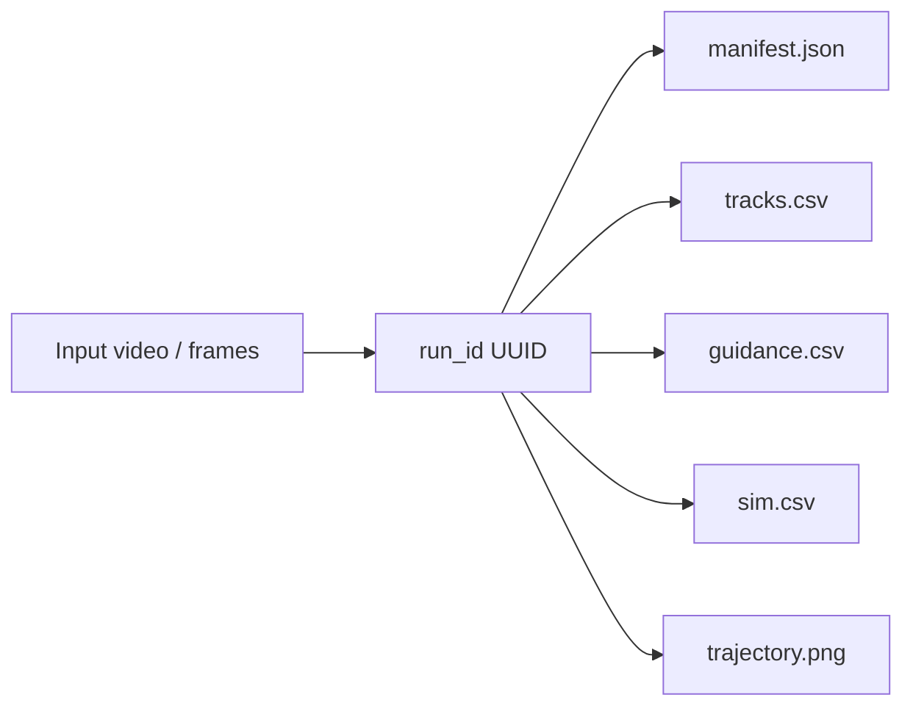

# Architecture

Master reference for **SeekerSim** components, data flow, types, and repository layout. Update this file when you add modules or change contracts.

---

## 1. System context

SeekerSim is a **single-process Rust application** (with optional HTTP API) that closes the loop:

```
imagery → detect → track → estimate state → compute guidance → advance simulation → log
```

All processing is **local**. There is no required network except optional HTTP for demos.



---

## 2. Architectural flow (per frame)

This is the **heartbeat** of the system. Every frame (or time step) runs the same pipeline.



### Step-by-step (plain language)

| Step | Input | Output | Owner module |
|------|--------|--------|--------------|
| 1. Ingest | Raw image bytes | `Frame` | `ingest/` |
| 2. Detect | `Frame` | `Vec<Detection>` | `vision/detector.rs` |
| 3. Associate | Detections + prior track | Best match or new track | `tracking/associator.rs` |
| 4. Filter | Bbox center measurement | `TrackState` (pos, vel) | `tracking/kalman.rs` |
| 5. LOS | Track position vs image center | `los`, `los_rate` | `tracking/los.rs` |
| 6. Guide | LOS, LOS rate, config gain N | `GuidanceCommand` | `guidance/pn.rs` |
| 7. Simulate | Command + prior sim state | `SimState` | `sim/engine.rs` |
| 8. Log | All of the above | CSV/JSON row | `telemetry/writer.rs` |

If detection is empty for a frame, tracker **coasts** (Kalman prediction only) for `max_coast_frames` then drops track.

---

## 3. Component diagram (internal modules)



---

## 4. Component reference

### 4.1 Entry & orchestration

| Component | File(s) | Responsibility |
|-----------|---------|----------------|
| **main** | `src/main.rs` | Load config, init tracing, start CLI or server |
| **cli** | `src/cli.rs` | `seeker-sim run --input ...` for local runs without HTTP |
| **pipeline** | `src/pipeline/mod.rs` | Owns the per-frame loop; enforces phase order and error policy |
| **config** | `src/config.rs` | Deserialize `config/default.toml` into `AppConfig` |

### 4.2 Ingest

| Component | Responsibility |
|-----------|----------------|
| **frame_source** | Abstract over folder iterator, future video/webcam |
| **decode** | Bytes → RGB tensor buffer via `image` crate |

### 4.3 Vision (AI)

| Component | Responsibility |
|-----------|----------------|
| **preprocess** | Resize, letterbox, normalize to model input tensor |
| **detector** | ONNX session lifecycle; run inference (acquisition / large objects) |
| **postprocess** | Parse YOLO output; NMS; produce `Detection` list |
| **motion** | Frame differencing; centroid of moving blob (small-target acquisition) |
| **roi_tracker** | Search local window around Kalman prediction; update point measurement |

**Perception modes** ([ADR-017](DECISIONS.md#adr-017-hybrid-perception-for-small-moving-targets)):

- `yolo` — Phase 2 single-image / large objects only.
- `motion` — synthetic or high-contrast small movers.
- `hybrid` — motion or YOLO to acquire; ROI + Kalman every frame (default for video intercept demo).

### 4.4 Tracking & estimation

| Component | Responsibility |
|-----------|----------------|
| **associator** | Match detection or centroid to existing track (IoU or distance gate) |
| **kalman** | Constant-velocity filter on target center (pixels) |
| **los** | Bearing from seeker reference (image center) and LOS rate |

### 4.5 Guidance & simulation

| Component | Responsibility |
|-----------|----------------|
| **pure_pursuit** | Steer toward instantaneous target direction (teaching baseline) |
| **pn** | `a_cmd = N * V_c * los_rate` (implementation details in code comments) |
| **engine** | Euler or RK2 integration of 2D positions |
| **state** | `SimState`, `SeekerState`, `TargetState` structs |

### 4.6 Telemetry & API

| Component | Responsibility |
|-----------|----------------|
| **record** | One row schema: frame index, track, guidance, sim |
| **writer** | Flush CSV/JSONL under `data/output/{run_id}/` |
| **routes** | HTTP mapping; no business logic |

---

## 5. Coordinate systems (fix early)

Document one choice and keep it consistent in code comments.

| Space | Origin | Used by |
|-------|--------|---------|
| **Image** | Top-left, x right, y down (pixels) | Detector, Kalman measurement |
| **Seeker bearing** | Angle from image center to target (radians) | Guidance |
| **Simulation** | 2D plane meters (arbitrary scale) | Simulator |

**Mapping (v1):** Map filtered image `(x, y)` offset from center to bearing `los = atan2(dx, dy)` or similar convention—locked in `tracking/los.rs` with a unit test.

---

## 6. Core data types

Implement in `src/domain/types.rs` (serde where noted).

### `Frame`

```text
frame_id: Uuid
index: u64          # 0-based frame number in run
timestamp_ms: u64   # monotonic or derived from fps
width, height: u32
source: String      # path or "webcam"
```

### `Detection`

```text
detection_id: Uuid
frame_id: Uuid
class_id: u32
class_name: String
confidence: f32
bbox: BBox          # x1,y1,x2,y2 in pixels
```

### `BBox`

```text
x1, y1, x2, y2: f32
center() -> (f32, f32)
```

### `TrackState`

```text
track_id: Uuid
frame_id: Uuid
position: (f32, f32)     # filtered center
velocity: (f32, f32)     # px/s or normalized/s
los: f32                 # radians
los_rate: f32            # rad/s
coast_count: u32
```

### `GuidanceCommand`

```text
frame_id: Uuid
law: enum { PurePursuit, ProportionalNavigation }
commanded_lateral_accel: f32   # sim units
```

### `SimState`

```text
time_s: f64
interceptor: Vec2
target: Vec2
interceptor_vel: Vec2
miss_distance: f32
```

### `RunManifest`

```text
run_id: Uuid
started_at: DateTime<Utc>
input_path: String
config_snapshot: ...
output_dir: PathBuf
```

---

## 7. Configuration (`config/default.toml`)

```toml
[server]
bind = "127.0.0.1:8080"

[vision]
model_path = "models/yolov8n.onnx"
input_size = 640
confidence_threshold = 0.5
iou_threshold = 0.45
target_class = ""   # empty = highest confidence box

[tracking]
iou_match_threshold = 0.3
max_coast_frames = 15

[guidance]
law = "pn"          # "pp" | "pn"
navigation_constant = 3.0
closing_velocity = 100.0   # sim units (tunable)

[sim]
dt_seconds = 0.033    # ~30 fps
initial_miss_distance = 500.0

[paths]
output_dir = "data/output"
```

---

## 8. Deployment view (developer machine)



No Kubernetes required for portfolio. Docker optional later.

---

## 9. HTTP API (planned)

| Method | Path | Purpose |
|--------|------|---------|
| GET | `/health` | Liveness |
| POST | `/v1/runs` | Start async or sync processing of `input_path` |
| GET | `/v1/runs/{id}` | Status + paths to output files |

CLI and API both call the same `pipeline::run(config, input)`.

---

## 10. Repository & file structure

```
Rust-AI-proj/
│
├── README.md
├── .gitignore
│
├── config/
│   └── default.toml              # Default parameters (committed)
│
├── docs/
│   ├── ARCHITECTURE.md           # This file
│   ├── TOOLS.md                  # Stack rationale
│   ├── LEARNING_ROADMAP.md       # Phases
│   ├── DECISIONS.md              # ADRs
│   ├── GLOSSARY.md
│   └── README.md
│
├── crates/
│   └── seeker-sim/
│       ├── Cargo.toml
│       ├── README.md             # Crate-local dev notes
│       └── src/
│           ├── main.rs           # Entry: tracing, config, cli vs serve
│           ├── lib.rs            # Re-exports modules for tests
│           ├── cli.rs            # clap commands
│           ├── config.rs         # TOML → AppConfig
│           │
│           ├── domain/
│           │   ├── mod.rs
│           │   ├── types.rs      # Frame, Detection, TrackState, ...
│           │   └── error.rs      # SeekerError enum
│           │
│           ├── pipeline/
│           │   └── mod.rs        # run(), process_frame()
│           │
│           ├── ingest/
│           │   ├── mod.rs
│           │   ├── frame_source.rs
│           │   └── decode.rs
│           │
│           ├── vision/
│           │   ├── mod.rs
│           │   ├── preprocess.rs
│           │   ├── detector.rs
│           │   └── postprocess.rs
│           │
│           ├── tracking/
│           │   ├── mod.rs
│           │   ├── associator.rs
│           │   ├── kalman.rs
│           │   └── los.rs
│           │
│           ├── guidance/
│           │   ├── mod.rs
│           │   ├── pure_pursuit.rs
│           │   └── pn.rs
│           │
│           ├── sim/
│           │   ├── mod.rs
│           │   ├── engine.rs
│           │   └── state.rs
│           │
│           ├── telemetry/
│           │   ├── mod.rs
│           │   ├── record.rs
│           │   └── writer.rs
│           │
│           └── api/
│               ├── mod.rs
│               └── routes/
│                   ├── mod.rs
│                   ├── health.rs
│                   └── runs.rs
│
├── models/                       # GITIGNORED
│   └── yolov8n.onnx
│
├── data/                         # GITIGNORED
│   ├── samples/                  # Small committed samples OPTIONAL (keep tiny)
│   ├── frames/                   # Extracted frame sequences
│   ├── videos/                   # Input MP4s
│   └── output/                   # Per-run CSV, plots, logs
│       └── {run_id}/
│           ├── tracks.csv
│           ├── guidance.csv
│           ├── sim.csv
│           └── manifest.json
│
└── scripts/
    ├── extract-frames.ps1        # ffmpeg → PNG folder
    └── download-model.ps1        # Fetch ONNX (document URL)
```

### Module dependency rule

```
api  →  pipeline  →  { ingest, vision, tracking, guidance, sim, telemetry }
                         ↓
                      domain
```

- **domain** must not depend on axum, ort, or api.
- **vision** may depend on `ort` only inside `detector.rs`.

---

## 11. Error handling policy

| Situation | Behavior |
|-----------|----------|
| Missing model file | Fail fast at startup with clear message |
| Empty detection | Coast track; if coast > max, `TrackLost` event in log |
| ONNX error | Return `SeekerError::Inference` abort run |
| Bad input path | `SeekerError::Input` before processing |

---

## 12. Testing strategy

| Layer | Test type |
|-------|-----------|
| `kalman.rs` | Unit: known measurements → expected state |
| `pn.rs` | Unit: constant LOS rate → expected sign of accel |
| `associator.rs` | Unit: IoU matrix cases |
| `pipeline` | Integration: synthetic 10-frame sequence → CSV row count |

---

## 13. Phase mapping (what appears when)

| Phase | New modules |
|-------|-------------|
| 1 | `main`, `config`, `api/routes/health` |
| 2 | `vision/*`, `domain/types` (Frame, Detection) |
| 3 | `ingest/*`, pipeline loop |
| 4 | `tracking/*` |
| 5 | `guidance/*`, `sim/*`, `telemetry/*` |
| 6 | `cli`, optional `opencv`, plots |
| 7 | Optional Ollama/Qdrant sidecar docs only |

See [LEARNING_ROADMAP.md](LEARNING_ROADMAP.md) for learning goals per phase.

---

## 14. Diagram: data artifacts per run



---

## 15. Change log (architecture)

| Date | Change |
|------|--------|
| 2026-05-23 | Initial SeekerSim architecture (replaced Sentinel ISR design) |

When you change types or folder layout, add a row here.
