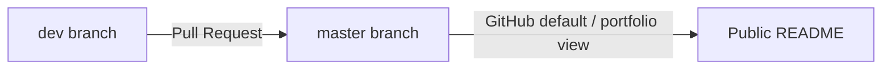

# GitHub setup

**Remote:** [https://github.com/Kschmidt111/Rust-AI-proj](https://github.com/Kschmidt111/Rust-AI-proj)

**Default branch:** `master` (stable, merge via PR only)  
**Development branch:** `dev` (day-to-day work)

---

## Branch workflow



| Branch | Purpose |
|--------|---------|
| **`master`** | Stable, demo-ready; only updated by merging PRs from `dev` |
| **`dev`** | Active development (Phase 1 code, experiments, WIP commits) |

You are currently set up with both branches on GitHub. **Work on `dev` locally**, push to `origin/dev`, open a PR into `master` when a phase is ready.

---

## Daily commands

```powershell
cd "c:\Users\schm3\OneDrive\Desktop\Rust AI proj"

# Make sure you are on dev
git checkout dev
git pull origin dev

# ... edit code, commit ...
git add .
git commit -m "Phase 1: add Axum health endpoint"
git push origin dev
```

Then open a PR: **base = `master`**, **compare = `dev`**

- [Create PR from dev → master](https://github.com/Kschmidt111/Rust-AI-proj/compare/master...dev)

**Before every push:** read [rules.md](../rules.md) and run:

```powershell
.\scripts\pre-push-check.ps1
```

---

## Opening a pull request (GitHub website)

1. Go to [https://github.com/Kschmidt111/Rust-AI-proj](https://github.com/Kschmidt111/Rust-AI-proj)
2. Click **Pull requests** → **New pull request**
3. **base:** `master` ← **compare:** `dev`
4. Add title + short description (what phase / what works)
5. **Create pull request** → **Merge pull request** when ready

After merge, sync local `dev` with updated `master`:

```powershell
git checkout master
git pull origin master
git checkout dev
git merge master
git push origin dev
```

---

## Optional: protect `master` (recommended)

Require PRs so nothing lands on `master` by accident:

1. [Repository Settings → Branches](https://github.com/Kschmidt111/Rust-AI-proj/settings/branches)
2. **Add branch protection rule**
3. Branch name pattern: `master`
4. Enable **Require a pull request before merging**
5. (Optional) **Require approvals** if working solo you can leave at 0 reviewers

---

## First-time clone (another machine)

```powershell
git clone https://github.com/Kschmidt111/Rust-AI-proj.git
cd Rust-AI-proj
git checkout dev
```

---

## Suggested repo description

> SeekerSim — Rust visual tracking + proportional navigation guidance simulation (ONNX / YOLO, software-in-the-loop)

## Suggested topics

`rust`, `computer-vision`, `object-tracking`, `onnx`, `yolo`, `guidance`, `kalman-filter`, `simulation`

---

## Legacy note

An unused `main` branch may still exist on GitHub from the initial repo creation. Safe to delete on GitHub (**Settings → Branches** or delete `main` on the branches page) if you only use `master` + `dev`.
