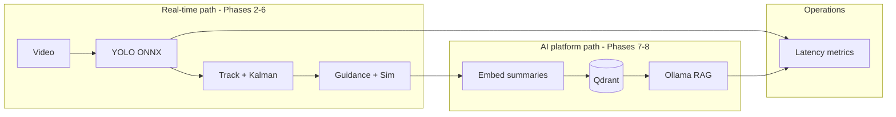

# Project Brief: SeekerSim

## Elevator pitch

**SeekerSim** is a Rust application that watches video, **identifies and tracks** a rapidly moving object, and runs a **closed-loop guidance simulation**—turning what the “seeker” sees into steering commands using classic **proportional navigation**. It is built for learning Rust and for portfolios targeting **defense/aerospace perception**, **AI/ML engineering**, and **real-time systems**—not for building operational weapons.

---

## Design north star — AI engineer positioning (2026)

Guidance from a founder interview (paraphrased):

> Don't just build a basic wrapper around OpenAI. Instead, build a pipeline that hosts and serves open-source models like Llama 3 locally using Ollama or vLLM. Build a custom data pipeline for continuous ingestion into a vector DB, and optimize the backend for low latency inference.
>
> Showing you can orchestrate the entire data flow and handle model deployment on actual hardware is what scales in 2026.

**This repo is intentionally designed to satisfy that bar—not as a ChatGPT demo, but as a real local ML platform.**

### How SeekerSim maps to that advice

| Founder requirement | How this project delivers it | Phase |
|---------------------|------------------------------|-------|
| **Not an OpenAI wrapper** | No required cloud LLM APIs; vision via **ONNX/YOLO** on your hardware | 2–6 |
| **Host open models locally** | **YOLO** (ONNX Runtime) + optional **Llama 3** via **Ollama** on your machine | 2–6, 8 |
| **Custom data pipeline** | Frames → detections → track events → **embeddings → Qdrant** (run history + detection memory) | 7 |
| **Continuous ingestion** | Each pipeline run **upserts** structured records + vectors (not one-off batch scripts) | 7 |
| **Low-latency inference** | Rust orchestration, bounded concurrency, **`tracing` latency spans**, p50/p95 per stage | 3–6, 8 |
| **Deploy on actual hardware** | Runs on **your GPU/CPU**; config-driven model paths; no mandatory cloud | 2+ |
| **Orchestrate full data flow** | Single Rust binary owns ingest → CV → track → sim → store → (optional) RAG query | 3–8 |

**Phases 2–6** prove **computer vision + real-time orchestration** (strong for perception and defense-adjacent roles).  
**Phases 7–8** prove **MLOps / AI engineer** skills (local LLM, vector DB, ingestion, RAG with citations).

Both stories share one codebase and one Rust service— that is the portfolio point.

---

## Problem statement

High-speed visual engagement (drones, debris, maneuvering targets) needs three capabilities working together:

1. **Perception** — Where is the object in this frame?
2. **Tracking** — Where is it going (velocity, smoothed state)?
3. **Guidance** — How should the interceptor maneuver given line-of-sight and line-of-sight rate?

Production systems split these across firmware, ML, and controls teams. SeekerSim implements a **minimal, end-to-end teaching version** in one repo so you can measure latency, swap models, and explain the math in interviews.

### Primary success criterion (Phases 3–6)

**A small moving target in video is tracked frame-to-frame, and a simulated interceptor closes to intercept it** (miss distance below a configured threshold), using local inference only—no cloud APIs.

This drives technical choices: hybrid **motion + Kalman + ROI tracking** for tiny targets, not YOLO-only on every frame ([ADR-017](DECISIONS.md#adr-017-hybrid-perception-for-small-moving-targets)).

---

## What we are building

| Capability | Description |
|------------|-------------|
| **Detection** | Find or **acquire** target per frame: YOLO (ONNX) and/or **motion blob** ([ADR-017](DECISIONS.md#adr-017-hybrid-perception-for-small-moving-targets)). |
| **Tracking** | Keep a stable `track_id`; **Kalman + ROI** for small point-like targets; handle brief occlusions. |
| **State estimation** | Kalman filter → position + velocity in image or world coordinates. |
| **Guidance** | Pure pursuit (Phase 5a) then **proportional navigation** (Phase 5b). |
| **Simulation** | 2D interceptor + target states updated each frame from guidance output. |
| **Telemetry** | Structured logs (JSON lines / CSV) for plots and replay. |
| **API** | Axum HTTP: health, run-on-file, fetch stats, query (later). |
| **Vector memory (AI engineer track)** | Embed detection/run summaries; **continuous upsert** to **Qdrant** | Phase 7 |
| **Local LLM (AI engineer track)** | **Ollama** (Llama 3 class) RAG over stored runs—grounded answers with citations | Phase 8 |
| **Latency & deployment** | p50/p95 per stage; model load once; optional GPU EP; documented hardware path | 3–8 |

### Explicit non-goals

- Real flight hardware, radios, or actuators
- Classified imagery or operational weapon integration
- 3D SLAM, radar fusion, or production-grade sensor fusion (future forks only)
- **Thin OpenAI / hosted-API wrapper as the product** — cloud APIs are not the architecture center

### Phased scope (not “optional fluff”)

Phases **7–8** are **required for the full AI-engineer portfolio narrative** described in [Design north star](#design-north-star--ai-engineer-positioning-2026). Phases **2–6** remain the foundation (vision + real-time path must work first).

---

## Primary user stories

| As a… | I want to… | So that… |
|-------|------------|----------|
| **Learner** | Run one command on a sample video | I see a **small target tracked** and an **intercept plot** |
| **Engineer** | Read heavily commented Rust | I map concepts from C# |
| **Interviewer** | See p95 frame latency + a plot of LOS vs command | I trust the system is real |

---

## Data strategy

| Source | Use |
|--------|-----|
| **Synthetic** | Moving dot/circle on black background — unit tests + PN tuning |
| **Public video** | Short clips: ball sports, RC drone, public domain jet clips |
| **Frame folders** | `ffmpeg` extracts PNG sequence — avoids fragile OpenCV builds early |

Never commit large binaries; use `data/` (gitignored).

---

## Success criteria by phase

| Phase | Done when |
|-------|-----------|
| **0** | Docs complete (this repo state) |
| **1** | `cargo run` serves `/health` |
| **2** | Still image → JSON detections |
| **3** | Frame folder or video → per-frame detections |
| **4** | Stable `track_id` + Kalman velocity in export |
| **5** | PN guidance + 2D sim + plot PNG |
| **6** | README demo: video in → `guidance.csv` + chart out |
| **7** | Qdrant ingestion: runs/detections embedded and searchable |
| **8** | Ollama RAG over Qdrant + latency metrics documented |
| **Portfolio** | 90s screen recording + metrics in README (CV + AI platform story) |

---

## Interview narratives

### Perception / defense (~30 seconds)

> “I built SeekerSim in Rust: ONNX-based detection on video frames, multi-frame tracking with a Kalman filter for velocity estimation, and a proportional navigation guidance loop driving a 2D intercept simulation—software-in-the-loop, no cloud dependency. I logged line-of-sight rate and commanded acceleration per frame and measured end-to-end latency on my GPU.”

### AI / ML engineer (~30 seconds)

> “It’s not an OpenAI wrapper. I orchestrate a local ML pipeline on my own hardware: YOLO via ONNX Runtime for vision, structured run telemetry ingested into Qdrant with embeddings, and Llama 3 through Ollama for grounded RAG over past detections—with p95 latency per stage and a single Rust service owning the full flow.”

### Follow-ups you can defend

- **Why not OpenAI?** Product requirement: on-prem, reproducible, deployable; demonstrates model hosting not API integration.
- **Why PN?** Classic LOS-rate feedback; standard teaching model for intercept problems.
- **Why Rust?** Predictable latency, safe concurrency for frame + inference pipelines.
- **Why ONNX + Ollama?** Two local model surfaces—vision and language—same orchestration layer.
- **Why Qdrant?** Continuous ingestion of run memory; semantic search + metadata filters for analyst-style queries.
- **What didn’t you do?** 3D, radar fusion, production EKF—scope kept intentional.

---

## Naming

| Item | Value |
|------|--------|
| **Product name** | SeekerSim |
| **Rust crate** | `seeker-sim` |
| **GitHub repo** | [Rust-AI-proj](https://github.com/Kschmidt111/Rust-AI-proj) |

“Seeker” = the notional sensor platform reading imagery; “Sim” = all dynamics are simulated.

---

## Document index

| Topic | File |
|-------|------|
| AI engineer north star (founder quote + mapping) | This file — [Design north star](#design-north-star--ai-engineer-positioning-2026) |
| Phase plan including Qdrant + Ollama | [LEARNING_ROADMAP.md](LEARNING_ROADMAP.md) |
| Architecture & data flow | [ARCHITECTURE.md](ARCHITECTURE.md) |
