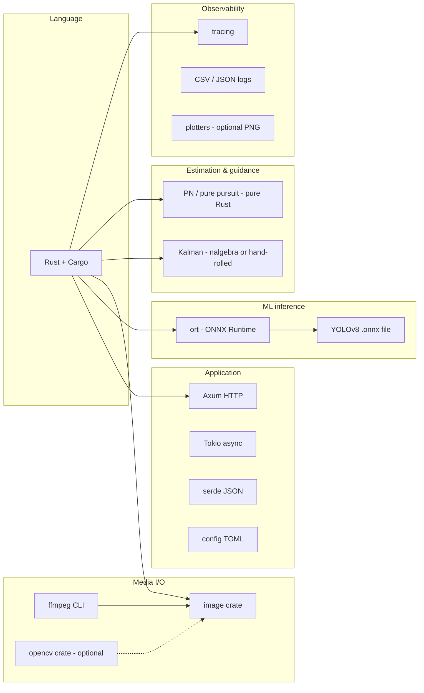

# Tools & Technology Stack

Reference document: **what we use**, **why**, and **what role it plays** in SeekerSim. Revisit when adding dependencies.

---

## Stack overview

---

## Core tools

### Rust + Cargo

| | |
|--|--|
| **What** | Systems language and build/package manager |
| **Why** | Memory safety without GC pauses; strong fit for real-time frame loops; interview signal for defense/robotics infra |
| **Used for** | Entire application: ingest, tracking, guidance, simulation, API, CLI |
| **C# analogy** | Rust + Cargo ≈ C# + `dotnet` CLI, but with ownership instead of GC |

**Install:** [https://rustup.rs](https://rustup.rs)

---

### Tokio

| | |
|--|--|
| **What** | Async runtime for Rust |
| **Why** | Industry standard; powers Axum; handles concurrent frame jobs and HTTP without blocking threads |
| **Used for** | `#[tokio::main]`, async HTTP handlers, optional background processing tasks |
| **Not used for** | Inner ONNX math (sync) unless we explicitly `spawn_blocking` |

---

### Axum

| | |
|--|--|
| **What** | Web framework built on Tokio + Tower |
| **Why** | Ergonomic routing and JSON extractors; similar mental model to ASP.NET Core minimal APIs |
| **Used for** | `GET /health`, `POST /v1/runs` (trigger processing), `GET /v1/runs/{id}` (status/results) |
| **Phase** | 1+ |

---

### serde + serde_json

| | |
|--|--|
| **What** | Serialization framework |
| **Why** | De facto standard; derive macros on structs |
| **Used for** | HTTP request/response bodies, JSON-lines telemetry, reading config |

---

### config TOML (`toml` crate + `config/default.toml`)

| | |
|--|--|
| **What** | Human-readable configuration file |
| **Why** | No recompile to change model path, thresholds, or sim parameters |
| **Used for** | Model path, confidence threshold, PN gain `N`, frame source paths, output directories |

---

### tracing + tracing-subscriber

| | |
|--|--|
| **What** | Structured logging |
| **Why** | Spans for `ingest`, `detect`, `track`, `guide` phases; filter by level in dev |
| **Used for** | Debug timing; production-style logs without `println!` everywhere |
| **C# analogy** | Similar to `ILogger<T>` + OpenTelemetry hooks |

---

### thiserror + anyhow (or only thiserror later)

| | |
|--|--|
| **What** | Error handling crates |
| **Why** | `thiserror` for typed domain errors; `anyhow` optional in `main` for ergonomic propagation while learning |
| **Used for** | `DetectError`, `TrackLost`, `ConfigError` with context |

---

## Machine learning & vision

### ONNX Runtime via `ort`

| | |
|--|--|
| **What** | Rust bindings to ONNX Runtime |
| **Why** | Run exported YOLO without Python in the inference path; CPU and CUDA execution providers |
| **Used for** | Load `models/yolov8n.onnx`, preprocess tensor, run session, parse output tensors to boxes |
| **Phase** | 2+ |
| **C# analogy** | Similar to `Microsoft.ML.OnnxRuntime.InferenceSession` |

---

### YOLOv8n (ONNX file, not a Rust crate)

| | |
|--|--|
| **What** | Small pretrained object detector exported to `.onnx` |
| **Why** | Fast on consumer GPU; good enough for balls, drones, vehicles; widely documented |
| **Used for** | Per-frame bounding boxes + class + confidence |
| **Obtain via** | Ultralytics export script in `scripts/export-yolo-onnx.md` (documented later) |
| **Stored in** | `models/` (gitignored) |

**Note:** We detect *a* target class or the highest-confidence box in v1; class filtering is config-driven.

---

## Media input/output

### `image` crate

| | |
|--|--|
| **What** | Safe Rust image decoding/encoding |
| **Why** | Easy Windows setup; no OpenCV build for Phase 2 still images |
| **Used for** | Load JPEG/PNG → RGB buffer → resize for YOLO input |

---

### ffmpeg (CLI, on PATH)

| | |
|--|--|
| **What** | Command-line media tool |
| **Why** | On Windows, building `opencv` Rust bindings is painful; extracting frames to a folder is reliable |
| **Used for** | `scripts/extract-frames.ps1` → `data/frames/run_001/%04d.png` |
| **Phase** | 3 (recommended path for video) |
| **Alternative** | `opencv` crate `VideoCapture` when you want single-binary video read |

---

### `opencv` crate (optional, Phase 3b or 6)

| | |
|--|--|
| **What** | Rust bindings to OpenCV |
| **Why** | Direct `VideoCapture` from file or webcam in one process |
| **Used for** | Webcam demo, live FPS measurement |
| **Trade-off** | Heavier dev setup on Windows; adopt when frame folders feel limiting |

---

## Tracking, estimation, guidance (no ML)

### Custom IoU tracker + Kalman filter

| | |
|--|--|
| **What** | Associate detections frame-to-frame; smooth state |
| **Why** | Teaches state estimation; required for velocity and LOS rate |
| **Used for** | `track_id`, `(x, y)`, `(vx, vy)` in pixel or normalized coordinates |
| **Implementation** | Start hand-rolled 4-state constant-velocity Kalman; optional `nalgebra` for linear algebra clarity |

---

### Proportional navigation (pure Rust)

| | |
|--|--|
| **What** | Guidance law: commanded accel ∝ line-of-sight rate |
| **Why** | Core “mid-flight adjustment from imagery” story without controls toolbox bloat |
| **Used for** | `commanded_accel` each frame from LOS / LOS_dot |
| **Inputs from vision** | Target bearing from bbox center relative to frame center (seeker boresight) |

---

### 2D kinematic simulator (pure Rust)

| | |
|--|--|
| **What** | Integrate interceptor + target positions in a plane |
| **Why** | Close the loop; produce plots; no external physics engine |
| **Used for** | `(x_i, y_i)`, `(x_t, y_t)`, miss distance over time |

---

## Output & visualization

### CSV + JSON Lines

| | |
|--|--|
| **What** | Plain-text telemetry |
| **Why** | Easy to inspect in Excel/Python; no DB required for MVP |
| **Used for** | `data/output/{run_id}/tracks.csv`, `guidance.csv` |

---

### `plotters` crate (optional)

| | |
|--|--|
| **What** | Rust plotting library |
| **Why** | Generate PNG charts in CI/demo without Python |
| **Used for** | LOS rate vs time, commanded accel vs time, 2D trajectories |

---

## Deferred / optional tools (Phase 7+)

| Tool | Why deferred | Future use |
|------|----------------|------------|
| **Qdrant** | Not needed for track+guide MVP | Search past runs by description |
| **Ollama** | Not on critical path | “Explain this run” over logs |
| **Docker** | Local binaries sufficient early | Pin Qdrant/Ollama if added |
| **CUDA / TensorRT** | Optimization pass | Faster ONNX after MVP works |

---

## Dependency table (planned `Cargo.toml`)

| Crate | Category | Phase introduced |
|-------|----------|------------------|
| `tokio` | Runtime | 1 |
| `axum` | HTTP | 1 |
| `serde`, `serde_json` | Serde | 1 |
| `tracing`, `tracing-subscriber` | Logs | 1 |
| `toml` | Config | 1 |
| `image` | Media | 2 |
| `ort` | ML | 2 |
| `uuid`, `chrono` | IDs/time | 3 |
| `csv` | Export | 4 |
| `plotters` | Viz | 5 |
| `nalgebra` | Math (optional) | 4 |
| `opencv` | Video (optional) | 6 |
| `reqwest` | HTTP client | 7 (Ollama only) |

Exact versions pinned when `Cargo.toml` is created in Phase 1.

---

## Development tools (not in production binary)

| Tool | Purpose |
|------|---------|
| `rustfmt` | Format code |
| `clippy` | Lint |
| `cargo test` | Unit tests for Kalman, PN, IoU |
| `ffmpeg` | Frame extraction |
| PowerShell scripts in `scripts/` | Download models, extract frames |

---

## What we are intentionally not using (and why)

| Alternative | Why not (for now) |
|-------------|-------------------|
| **Python + PyTorch in hot path** | You asked for Rust learning; ONNX keeps ML portable |
| **OpenAI / hosted LLM** | Not needed for guidance; optional later for log Q&A |
| **ROS2** | Heavy setup; this is a focused portfolio binary |
| **Unity / Gazebo** | 2D Rust sim is enough for v1 |
| **TensorFlow Lite** | ONNX + `ort` is simpler cross-platform for YOLO exports |

---

## Environment checklist

Before Phase 2:

- [ ] `rustc --version` stable
- [ ] `cargo --version`
- [ ] `models/yolov8n.onnx` present (via script)
- [ ] Sample frames in `data/samples/`
- [ ] (Phase 3+) `ffmpeg -version`
